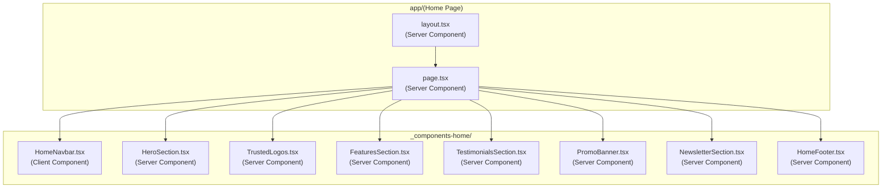
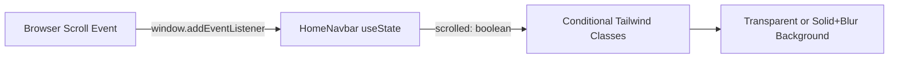

# Design Document: Home Page Redesign

## Overview

This design covers a complete visual overhaul of the platform's home page (`app/(Home Page)/page.tsx`) and its child components. The redesign replaces the current light-themed, green-accented layout with a modern dark-themed design using deep navy (#0F172A) and electric indigo (#6366F1) as the primary palette. The architecture preserves the existing Next.js App Router conventions — a server component page composing section components — while introducing a single client component (`HomeNavbar`) for scroll-aware interactivity.

### Key Design Decisions

1. **Server-first rendering**: The main page and all section components remain React Server Components. Only `HomeNavbar` uses `"use client"` for scroll detection via `useState`/`useEffect`.
2. **Tailwind-only styling**: No inline style objects, no external CSS libraries. All visual effects (glass-morphism, gradients, hover transitions) use Tailwind utility classes.
3. **No new dependencies**: The redesign uses only packages already in `package.json` — `lucide-react`, `next/link`, `next/image`, and Tailwind CSS.
4. **Replace, don't extend**: Existing home page components (`NavBarHome`, `LandingPage`, `HomeSection2`, `TestemonilsSec`, `DiscoutSec`) are replaced by new components. The old files can be removed after implementation.
5. **Footer moves inline**: The current `components/Footer.tsx` (used via layout) is replaced by a new footer rendered directly within the page composition, allowing the home page to have its own dark-themed footer without affecting other routes.

## Architecture



### Data Flow



All other components are purely presentational with static data defined as constants within each file. No API calls, no database queries, no client-side state beyond the navbar scroll detection.

## Components and Interfaces

### 1. Layout (`app/(Home Page)/layout.tsx`)

**Changes**: Remove the existing `<Footer />` import from `@/components/Footer`. The layout becomes a minimal wrapper that renders `{children}` only. The home-specific footer is composed within `page.tsx`.

```typescript
// app/(Home Page)/layout.tsx
export default function HomeLayout({ children }: { children: React.ReactNode }) {
  return <>{children}</>;
}
```

**Rationale**: The home page needs its own dark-themed footer that differs from the shared footer used on other routes. Moving footer rendering into the page composition gives full control.

### 2. Page (`app/(Home Page)/page.tsx`)

**Type**: React Server Component (no `"use client"`)

**Responsibility**: Compose all section components in order. Apply the global dark background.

```typescript
// Composition order:
// 1. HomeNavbar (client, sticky)
// 2. HeroSection (includes Trusted Logos inline)
// 3. FeaturesSection
// 4. TestimonialsSection
// 5. PromoBanner
// 6. NewsletterSection
// 7. HomeFooter
```

The page wraps everything in a `<main>` with `bg-[#0F172A] min-h-screen text-white`.

### 3. HomeNavbar (`_components-home/HomeNavbar.tsx`)

**Type**: Client Component (`"use client"`)

**Props**: None

**State**:
- `scrolled: boolean` — toggled when `window.scrollY > 0`

**Behavior**:
- `useEffect` attaches a scroll listener on mount, cleans up on unmount
- When `scrolled` is false: `bg-transparent`
- When `scrolled` is true: `bg-[#0F172A]/95 backdrop-blur-md border-b border-white/10`
- Positioned with `fixed top-0 left-0 right-0 z-50`

**Content**:
| Element | Details |
|---------|---------|
| Logo | Text "Learn" in bold white, links to `/` |
| Nav Links | "Dashboard" → `/dashboard`, "Explore" → `/explore` |
| Auth Buttons | "Sign Up" → `/sign-up` (indigo bg), "Sign In" → `/sign-in` (outlined) |

### 4. HeroSection (`_components-home/HeroSection.tsx`)

**Type**: Server Component

**Layout**: Two-column on desktop (`lg:grid-cols-2`), stacked on mobile. Full viewport height (`min-h-screen`), padded top to account for fixed navbar (`pt-24`).

**Left Column**:
- Headline: `text-5xl md:text-6xl font-bold text-white`
- Subtext: `text-lg text-slate-300`
- Two CTA buttons (primary indigo, secondary outlined)
- Two stat badges (pill-shaped, `bg-white/10` background)

**Right Column** (desktop only, hidden on mobile via `hidden lg:block`):
- Live Session Card: `bg-white/5 backdrop-blur-md border border-white/10 rounded-2xl p-6`
- Contains avatar (using `next/image`), "English with Sarah" text, pulsing green dot

**Stat Badges**:
- "4.8/5 Rating" with 5 filled Star icons from lucide-react
- "98% Success Rate" with percentage display

### 5. TrustedLogos (`_components-home/TrustedLogos.tsx`)

**Type**: Server Component

**Content**: Heading "Trusted by learners from" + 5 placeholder company names rendered as styled text in `text-slate-500 font-medium`. Displayed in a `flex items-center justify-center gap-8 flex-wrap` container.

**Logo names** (placeholder text): "Google", "Microsoft", "Amazon", "Meta", "Apple"

### 6. FeaturesSection (`_components-home/FeaturesSection.tsx`)

**Type**: Server Component

**Layout**: Section heading centered, followed by a responsive grid (`grid-cols-1 md:grid-cols-2 lg:grid-cols-3 gap-8`).

**Feature Cards** (6 total):

| Icon | Title | Description |
|------|-------|-------------|
| BookOpen | Expert-Led Courses | Learn from industry professionals with years of teaching experience |
| Users | Community Learning | Join study groups and collaborate with learners worldwide |
| Video | Live Sessions | Attend real-time interactive classes with instant feedback |
| User | Personal Mentorship | Get one-on-one guidance tailored to your learning pace |
| Globe | Global Access | Study from anywhere with courses available in multiple languages |
| BarChart | Progress Analytics | Track your growth with detailed performance dashboards |

**Card Styling**:
```
bg-white/5 border border-white/10 rounded-xl p-6
hover:-translate-y-1 transition-all duration-300
```

**Icon Container**: `w-12 h-12 rounded-full flex items-center justify-center` with per-card accent color backgrounds (e.g., `bg-indigo-500/20`, `bg-emerald-500/20`).

### 7. TestimonialsSection (`_components-home/TestimonialsSection.tsx`)

**Type**: Server Component

**Layout**:
- Mobile: `flex overflow-x-auto snap-x snap-mandatory gap-4 pb-4` (horizontal scroll)
- Desktop: `md:grid md:grid-cols-3 md:gap-6`

**Testimonials Data** (5 entries):

| Name | Initials | Color | Stars | Quote |
|------|----------|-------|-------|-------|
| Sarah Mitchell | SM | bg-indigo-500 | 5 | "The live sessions transformed my understanding of web development. The instructors break down complex topics into digestible lessons." |
| James Rodriguez | JR | bg-emerald-500 | 5 | "I landed my first developer role within three months of completing the full-stack course. The project-based curriculum made all the difference." |
| Aisha Patel | AP | bg-amber-500 | 4 | "The community aspect sets this platform apart. Study groups and peer reviews accelerated my learning beyond what I expected." |
| Marcus Chen | MC | bg-rose-500 | 5 | "Progress tracking kept me motivated throughout the six-month data science program. Seeing measurable improvement each week was incredibly rewarding." |
| Elena Kowalski | EK | bg-cyan-500 | 4 | "Flexible scheduling meant I could upskill while working full-time. The recorded sessions and downloadable resources were invaluable." |

**Card Styling**: `bg-white/5 border border-white/10 rounded-xl p-6 snap-start min-w-[300px] md:min-w-0`

**Avatar**: Colored circle with white initials text, no external images.

### 8. PromoBanner (`_components-home/PromoBanner.tsx`)

**Type**: Server Component

**Styling**: `bg-gradient-to-r from-indigo-600 to-purple-600 py-16 px-4`

**Content**:
- Headline: "Get 20% off on your next course" (`text-3xl md:text-5xl font-bold text-white text-center`)
- Subtext: "Limited time offer for new learners" (`text-white/80`)
- CTA Button: "Claim Discount" (`bg-white text-indigo-600 font-semibold px-8 py-3 rounded-lg hover:bg-white/90`) linking to `/explore`

### 9. NewsletterSection (`_components-home/NewsletterSection.tsx`)

**Type**: Server Component

**Layout**: Centered content within `max-w-2xl mx-auto`, dark background consistent with page.

**Content**:
- Heading: "Stay updated with new courses and offers"
- Subtext: "Get weekly insights, course launches, and exclusive discounts delivered to your inbox."
- Form: `flex` container with email input + submit button
  - Input: `bg-white/5 border border-white/10 rounded-lg px-4 py-3 text-white placeholder:text-slate-500 flex-1`
  - Button: `bg-indigo-600 hover:bg-indigo-700 text-white font-semibold px-6 py-3 rounded-lg`

**Note**: The form is presentational (no server action wired up). The `<form>` element prevents default submission.

### 10. HomeFooter (`_components-home/HomeFooter.tsx`)

**Type**: Server Component

**Layout**: Two-row structure within `max-w-7xl mx-auto`.

**Row 1** (top): 
- Left: "Learn" logo text (bold, white)
- Right: Social icons (Facebook, Instagram, Twitter/X, GitHub) as inline SVGs with `text-slate-400 hover:text-white transition-colors`

**Row 2** (bottom):
- Three link columns:
  - **Platform**: Dashboard, Explore, Pricing, Live Sessions
  - **Resources**: Blog, Documentation, Community, Tutorials
  - **Company**: About, Careers, Contact, Privacy Policy
- Column headings: `text-white font-semibold`
- Links: `text-slate-400 hover:text-slate-200 transition-colors`

**Copyright**: `text-slate-500 text-sm` — "© 2024 Learn. All rights reserved."

**Separator**: `border-t border-white/10` between link columns and copyright.

## Data Models

This feature uses no database models or API data. All content is static and defined as TypeScript constants within component files.

### Static Data Structures

```typescript
// Features data shape
interface Feature {
  icon: React.ReactNode;
  title: string;
  description: string;
  iconBg: string; // Tailwind bg class for icon container
}

// Testimonial data shape
interface Testimonial {
  name: string;
  initials: string;
  avatarColor: string; // Tailwind bg class
  stars: number; // 3-5
  quote: string;
}

// Footer link column shape
interface FooterColumn {
  title: string;
  links: { label: string; href: string }[];
}
```

## Error Handling

This feature is entirely presentational with no data fetching, form submissions, or external API calls. Error handling considerations:

1. **Image loading**: The `next/image` component in the Live Session Card avatar uses a local image (`/imgs/1.jpg`). If the image fails to load, the `alt` text provides fallback context.
2. **Scroll listener**: The `useEffect` in `HomeNavbar` includes cleanup to prevent memory leaks. The scroll handler uses no async operations, so no error boundary is needed.
3. **Link navigation**: All `next/link` elements point to known internal routes. No dynamic route construction that could produce invalid URLs.
4. **Newsletter form**: Since no server action is wired, the form simply prevents default submission. A future iteration would add form validation and error states.

## Testing Strategy

### Why Property-Based Testing Does NOT Apply

This feature is a **UI rendering and layout redesign**. It involves:
- Visual component composition with static data
- CSS styling via Tailwind utility classes
- A single scroll-detection interaction (boolean state toggle)
- No data transformations, parsers, serializers, or algorithmic logic

PBT requires universal properties over a meaningful input space. This feature has no such input space — the components render fixed content with fixed styling. The only dynamic behavior (scroll detection) is a simple boolean toggle with no edge cases that benefit from randomized testing.

### Recommended Testing Approach

**Visual Regression Tests** (primary):
- Capture screenshots of each section at mobile (375px), tablet (768px), and desktop (1280px) breakpoints
- Compare against approved baselines after implementation

**Example-Based Unit Tests**:
- `HomeNavbar`: Verify that the `scrolled` state toggles correctly and applies the expected class names
- `HomeNavbar`: Verify all navigation links render with correct `href` attributes
- `HeroSection`: Verify CTA buttons link to `/dashboard` and `/explore`
- `FeaturesSection`: Verify all 6 feature cards render with correct titles
- `TestimonialsSection`: Verify all 5 testimonials render with unique quotes
- `PromoBanner`: Verify the "Claim Discount" button links to `/explore`

**Accessibility Checks**:
- All interactive elements meet 44x44px minimum touch target
- Color contrast ratios meet WCAG AA (white text on #0F172A = 15.4:1 ratio, passes)
- All images have meaningful `alt` text
- Navigation is keyboard-accessible
- Semantic HTML structure (nav, main, section, footer elements)

**Smoke Tests**:
- Page renders without hydration errors
- No console errors on initial load
- Scroll behavior transitions work in Chrome, Firefox, Safari

### File Structure After Implementation

```
app/(Home Page)/
├── layout.tsx                    (simplified, no Footer import)
├── page.tsx                      (server component, composes sections)
└── _components-home/
    ├── HomeNavbar.tsx            (client component - scroll behavior)
    ├── HeroSection.tsx           (server component)
    ├── TrustedLogos.tsx          (server component)
    ├── FeaturesSection.tsx       (server component)
    ├── TestimonialsSection.tsx   (server component)
    ├── PromoBanner.tsx           (server component)
    ├── NewsletterSection.tsx     (server component)
    └── HomeFooter.tsx            (server component)
```

Old files to remove after implementation:
- `_components-home/NavBarHome.tsx`
- `_components-home/BtnsHome.tsx`
- `_components-home/LandingPage.tsx`
- `_components-home/HomeSection2.tsx`
- `_components-home/TestemonilsSec.tsx`
- `_components-home/DiscoutSec.tsx`
- `_components-home/HomePage.tsx`
- `_components-home/SmallIcon.tsx`
- `_components-home/Logo.tsx`

The shared `components/Footer.tsx` remains unchanged for use by other routes (Dashboard, etc.).
